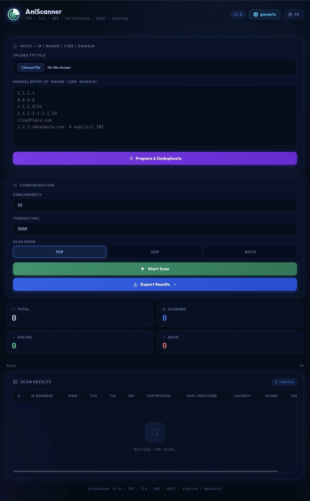

# AniScanner

Modern Network Scanner for Termux & Web Dashboard

AniScanner is a lightweight Python-based TCP/TLS/SNI network scanner with a modern real-time web interface designed for Termux and Linux environments.

---

## Features

- TCP Connectivity Scan
- UDP Probe Support
- TLS Version Detection
- SNI Validation
- CDN / Provider Detection
- ASN Information
- Live SSE Dashboard
- Real-time Scan Results
- Modern Dark UI
- Termux Friendly

---

## Screenshot

<p align="center">
  
</p>

---

## Installation (Termux)

```bash
pkg update -y
pkg install python git -y

git clone https://github.com/ForExampleZERO/AniScanner.git

cd AniScanner

pip install -r requirements.txt

python app.py
```

Open in browser:

```txt
http://127.0.0.1:5000
```

---

## Project Structure

```txt
AniScanner/
├── app.py
├── requirements.txt
├── templates/
├── static/
│   └── img/
│       └── preview.png
└── scanner/
```

---

## Technologies

- Python
- Flask
- AsyncIO
- HTML/CSS/JS
- SSE Streaming

---

## Notes

This project is designed for educational, network analysis and testing purposes.

---

## Community

Telegram Group:  
https://t.me/OnlyNightx

Telegram Channel:  
https://t.me/aniartx
